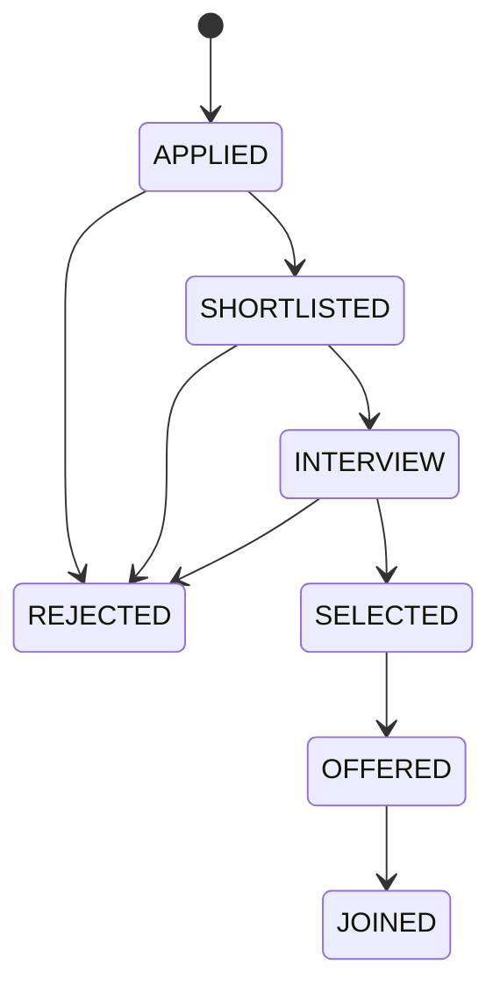

# Job application workflow

Applications are submitted through `POST /api/job-drives/{job_drive_id}/applications`. The backend loads the authenticated student's saved profile and the persisted job drive, re-evaluates eligibility with the reusable eligibility service, checks publication state and the timezone-aware deadline, then creates the application and its initial status-history event in one transaction. Client-provided eligibility values are never accepted. The database's unique `(student_id, job_drive_id)` constraint prevents duplicates, including concurrent submissions.

The migration maps legacy `under_review` records to `SHORTLISTED` and legacy `withdrawn` records to `REJECTED`, then adds a baseline timeline event for every existing application.

## Status lifecycle

The status service enforces the following directed transitions:

`REJECTED` and `JOINED` are terminal. Only admins can move applications through the status graph. An admin selects candidates by moving applications to `SELECTED`. Direct transition to `OFFERED` is blocked: issuing a selected candidate's offer advances the application to `OFFERED` and records the transition. Candidates must accept an issued offer before an admin can move the application to `JOINED`. Every application transition records its previous/next status, actor, optional note, and timestamp in `application_status_events`. See [offers.md](offers.md) for details.

## Access rules

- Students can submit applications and list/read only their own applications.
- Admins can list/read all applications and manage their statuses.
- Recruiters can list/read applications attached to job drives owned by their company. They cannot change status or apply as students.
- Other roles are denied access. A student cannot apply to a draft, closed, or cancelled drive; the drive must also have an unexpired deadline and the student must pass every configured eligibility criterion.

## API

All routes require authentication.

| Method | Path | Access | Purpose |
| --- | --- | --- | --- |
| `POST` | `/job-drives/{job_drive_id}/applications` | Student | Validate and submit an application. Optional `cover_letter`. |
| `GET` | `/applications` | Student, admin, recruiter | List own, all, or company-scoped applications; supports `status`, `job_drive_id`, `limit`, and `offset`. |
| `GET` | `/applications/{application_id}` | Student, admin, recruiter | Read an application and its status timeline within the caller's access scope. |
| `PATCH` | `/applications/{application_id}/status` | Admin | Transition status with optional internal `note`. |

Ineligible, expired, unpublished, duplicate, or invalid-transition attempts return `409`. Unauthorized roles receive `403`; student/recruiter access outside their scope returns `404`.

The frontend provides an eligibility-aware Apply action, success confirmation, My Applications, application details and timeline, admin shortlist/reject/stage controls, and recruiter company-scoped application review.
