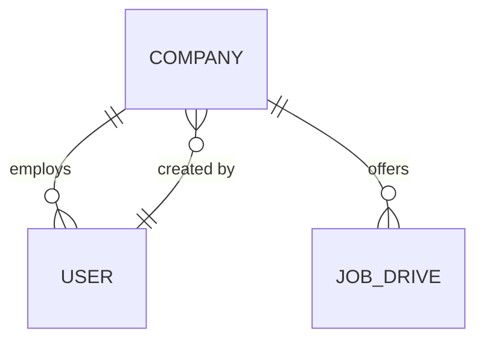

# Company management

Company records are managed by placement administrators. A company keeps its employer profile and HR contact information; it can be deactivated without deleting it or disturbing placement history. All company management endpoints require an active user with the `ADMIN` role.

## Company fields

`name` is required and unique. `industry`, `location`, `website`, `hr_name`, `hr_email`, and `description` are optional. Text is trimmed and bounded, the website must be an HTTP or HTTPS URL, and the HR email must be valid. Company records have created/updated timestamps and an `is_active` state.

Recruiters are `users` with `role='recruiter'` and a required `company_id` foreign key. The database check constraint and foreign key prevent orphaned recruiter accounts. Admins provision recruiters through the company API, with passwords hashed using the existing password service. Moving a recruiter changes its company association. Recruiter email addresses are globally unique.

## API

All routes are under `/api` and require a bearer JWT for an administrator.

| Method | Path | Purpose |
| --- | --- | --- |
| `GET` | `/companies?q=&industry=&is_active=&limit=&offset=` | Search by company name, industry, or location; filter by exact industry and active state. |
| `POST` | `/companies` | Create a company. |
| `GET` | `/companies/{company_id}` | Read company details and associated recruiter summaries. |
| `PATCH` | `/companies/{company_id}` | Edit company fields or activate/deactivate it. |
| `POST` | `/companies/{company_id}/recruiters` | Create a recruiter account already attached to this company. |
| `PUT` | `/companies/{company_id}/recruiters/{recruiter_user_id}` | Move an existing recruiter to this company. |

Duplicate company names and recruiter emails return `409`; invalid input returns `422`; missing resources return `404`; non-admin callers receive `403`. Inactive companies cannot receive new or transferred recruiter accounts.

## Data relationships



The `users.company_id` relationship is nullable for roles that do not belong to an employer. A check constraint makes it mandatory for recruiter users. `companies.created_by_user_id` records which admin created the company and becomes null if that user is removed. Company rows are deactivated instead of deleted.

Apply the migration from `backend/` after setting `DATABASE_URL`:

```bash
alembic upgrade head
```
