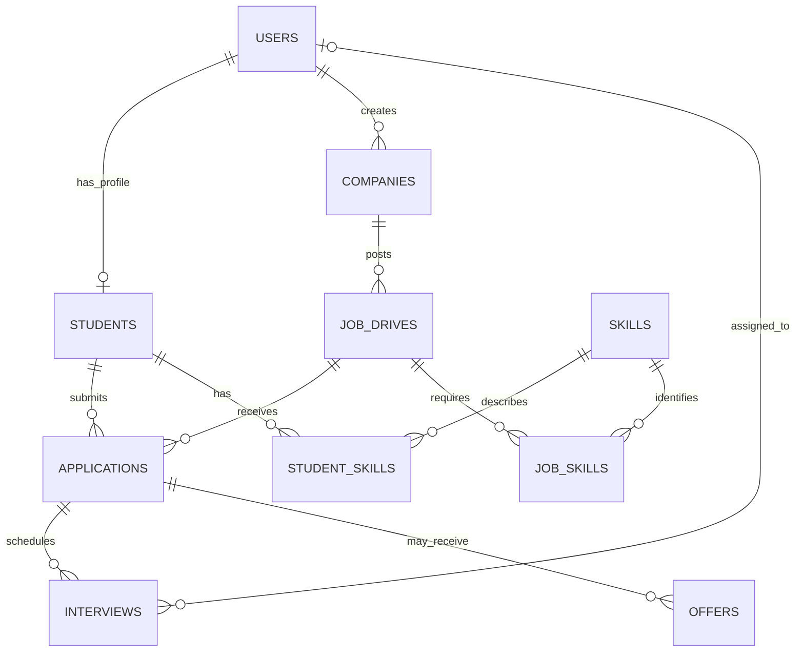

# Database design

## Overview

The database is PostgreSQL and is managed with SQLAlchemy 2.x and Alembic. A modular monolith uses one relational schema for the placement lifecycle. The initial migration creates the domain foundation; API authorization and workflow services are responsible for lifecycle rules that depend on more than one row.

All domain tables include `created_at` and `updated_at` timestamps. `updated_at` is advanced by SQLAlchemy ORM updates. Foreign keys specify deletion behavior to preserve placement records where they have operational history.

## Entity meaning

| Table | Business meaning |
| --- | --- |
| `users` | Login identity, display name, role, active flag, and password hash. Roles are stored in lowercase: `student`, `admin`, `recruiter`, `interviewer`. |
| `students` | Academic and placement profile linked one-to-one with a user: student number, branch, graduation year, CGPA, backlog count, and resume URL. |
| `companies` | Employer organization and optional user who created its record. |
| `job_drives` | A role or hiring drive from a company, with publication status, deadline, compensation, and eligibility criteria. Allowed branches are stored as JSON. |
| `applications` | A student's application to a job drive, with a lifecycle status and application time. |
| `interviews` | A scheduled interview for an application, optionally assigned to an interviewer user, with outcome and feedback. |
| `offers` | Draft and issued compensation offers, response/expiry state, joining date, and offer letter reference. |
| `skills` | Canonical skill vocabulary shared by student profiles and job requirements. |
| `student_skills` | Student-to-skill association with optional proficiency. |
| `job_skills` | Job-drive-to-skill association indicating whether the skill is required. |

## Relationships



`student_skills` and `job_skills` implement many-to-many relationships and retain association-specific attributes.

## Important constraints and indexes

- User email, student user link, student number, company name, and skill name are unique.
- A student can have only one application per job drive (`student_id`, `job_drive_id` unique).
- An application can have one active draft or issued offer at a time; a partial unique index allows terminal offer records to remain as history.
- A student CGPA and job minimum CGPA must be between 0 and 10; backlog counts cannot be negative.
- Status columns use database check constraints to restrict values to the supported initial states.
- All association rows and workflow records reference their owning rows through foreign keys. Applications, interviews, and offers restrict deletion of records needed to preserve workflow history; skill links cascade with their parent profile/job/skill.
- Indexes cover user roles, student graduation year and branch, drives by status/deadline and company, applications by drive/status and student/time, interview schedules, offer status, and skill lookups.

The schema constrains valid status values, while valid transitions and cross-row business rules are enforced transactionally by services. Applications can receive offers only after ADMIN selection, and an offer issue advances the application to OFFERED. See [docs/offers.md](offers.md) for the offer workflow.

## Migration and development seed

Set `DATABASE_URL` in the repository root `.env` to a PostgreSQL URL, then from `backend/` run:

```bash
source .venv/bin/activate
alembic upgrade head
python -m app.db.seed
```

The seed command inserts common skill names only, is safe to rerun, and creates no users or credentials. `app.db.session.get_engine()` provides the shared SQLAlchemy engine configuration and fails clearly when `DATABASE_URL` is unset.
