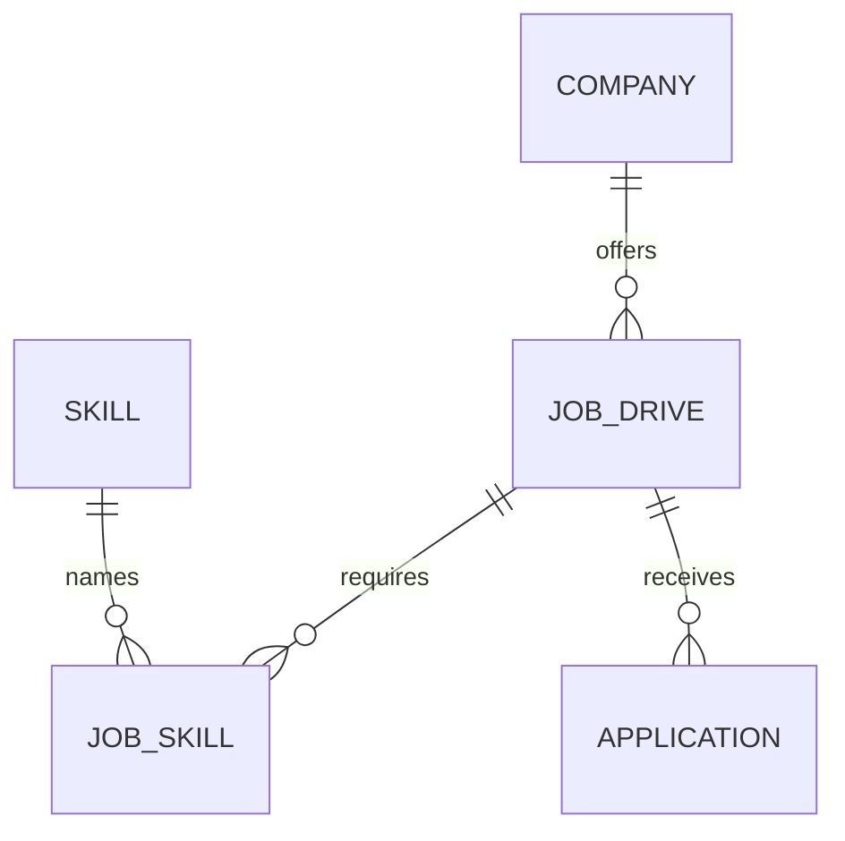

# Job drive management

Job drives are owned by a company and have a controlled lifecycle. They are created as drafts, can be published when the company is active and a future timezone-aware application deadline is set, and can then be closed. An admin may cancel a draft or a published drive. Closed and cancelled drives are terminal. Job drive submission/application creation is not part of this milestone.

## Drive fields

The job drive stores its company, title, description, annual package range in INR lakhs (LPA), location, employment type, minimum CGPA, maximum backlogs, allowed branches, graduation year, required skills, application deadline, and status. Required skills use the existing `skills` and `job_skills` tables. An empty or null allowed-branch list means any branch. Required skill and branch names are normalized and duplicates are rejected.

The database enforces the four statuses, a valid CGPA range, nonnegative backlogs, graduation year of 2000 or later, and nonnegative ordered package values. The service validates status transitions and requires a future deadline to publish. Editing closed or cancelled drives is rejected.

## Access rules

- `ADMIN` can create and edit drives, transition status, search/filter across drives, and view applicants.
- `STUDENT` can search and view published drives for active companies only.
- `RECRUITER` can search and view all drives belonging to their associated company. Other companies' drives appear as not found.
- Applicant viewing is administrator-only. It is a read-only view of existing application rows and displays an empty state until a later application-submission milestone.

## API

All routes are under `/api` and require an authenticated account.

| Method | Path | Access | Purpose |
| --- | --- | --- | --- |
| `GET` | `/job-drives?q=&location=&employment_type=&graduation_year=&status=&company_id=` | Admin, student, recruiter | Search/filter; results are visibility-scoped by role. |
| `POST` | `/job-drives` | Admin | Create a draft. |
| `GET` | `/job-drives/{drive_id}` | Admin, student, recruiter | Read visible drive details. |
| `PATCH` | `/job-drives/{drive_id}` | Admin | Edit non-terminal drive fields. |
| `POST` | `/job-drives/{drive_id}/publish` | Admin | Draft to published. |
| `POST` | `/job-drives/{drive_id}/close` | Admin | Published to closed. |
| `POST` | `/job-drives/{drive_id}/cancel` | Admin | Draft or published to cancelled. |
| `GET` | `/job-drives/{drive_id}/applicants` | Admin | Read applications and student summaries for a drive. |

Invalid fields return `422`, invalid lifecycle transitions return `409`, and out-of-scope/missing records return `404`.



Apply the job drive validation migration from `backend/` after setting `DATABASE_URL`:

```bash
alembic upgrade head
```
